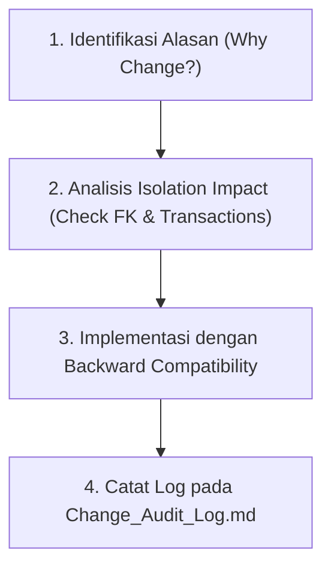

# Change Audit Log & Architecture Decision Record (ADR)
## Sistem ERP/CRM CV Solusi Inovasi Packaging

---

### 📌 Document Information
* **Document Version:** `1.0`
* **Last Updated:** `2026-10-02`
* **Status:** `APPROVED & EXECUTED`
* **Project Module:** `MOD-01 (Inventory Microservice)` & `MOD-03 (BOM Engine)`

---

## 📄 Audit Log Record: ADR-001

### 1. Judul Perubahan (Change Title)
**Refactoring Satuan Ukuran Produk (*Units of Measurement*) dari String Terbuka menjadi Master Data Relasional (`units`)**

---

### 2. Konteks & Alasan Perubahan (Context & Rationale)
* **Kondisi Awal (Base Plan):**
  Pada rencana awal (*Implementation Plan*), kolom `unit` pada tabel `materials` disimpan sebagai string terbuka (contoh: `"Rim"`, `"Lembar"`, `"Kg"`).
* **Masalah Yang Ditemukan (Pain Point):**
  1. **Integritas Data:** Penginputan string bebas berisiko menyebabkan ketidakseragaman variabel (*typo* / variasi penulisan seperti `"rim"`, `"Rim"`, `"RIM"`).
  2. **Kebutuhan Sprint 3 (BOM Engine & Konversi Satuan):** Modul BOM Engine memerlukan kepastian kode satuan baku (*Unit Code*) agar rumus konversi kertas (misal: 1 Rim = 500 Lembar) dapat dihitung secara otomatis dan konsisten tanpa error parsing string.

---

### 3. Keputusan Teknis (Architectural Decision)
Disetujui untuk mengubah skema `unit` dari string statis menjadi **Master Data Relasional `units`** dengan tetap mempertahankan fallback kolom `unit` (string) untuk memastikan 100% *backwards compatibility*.

---

### 4. Ringkasan File Yang Dibuat & Diubah (File Change Matrix)

| No | Nama File | Tipe Aksi | Keterangan Perubahan |
| :-: | :--- | :--- | :--- |
| 1 | `database/migrations/2026_09_29_050041_01_create_units_table.php` | **CREATED** | Migrasi tabel `units` (`id`, `name`, `code`, `description`). |
| 2 | `database/migrations/2026_09_29_050042_create_materials_table.php` | **UPDATED** | Menambahkan Foreign Key `unit_id` me-refer ke `units(id)`. |
| 3 | `app/Models/Unit.php` | **CREATED** | Model Eloquent `Unit` beserta relasi `hasMany(Material::class)`. |
| 4 | `app/Models/Material.php` | **UPDATED** | Menambahkan `unit_id` ke `$fillable` & relasi `unitRelation()`. |
| 5 | `app/Http/Controllers/Api/V1/UnitController.php` | **CREATED** | API Controller CRUD Master Data Satuan Ukuran (`/api/v1/units`). |
| 6 | `routes/api.php` | **UPDATED** | Mendaftarkan route `apiResource('units', UnitController::class)`. |
| 7 | `database/seeders/MasterDataSeeder.php` | **UPDATED** | Seeding 8 Satuan Baku Percetakan (`RIM`, `LBR`, `PLN`, `KG`, `KLG`, `RLL`, `PCS`, `BOX`). |
| 8 | `app/Http/Controllers/Api/V1/MaterialController.php` | **UPDATED** | Validasi `unit_id` & `with('unitRelation')` pada response JSON. |

---

### 5. Analisis Dampak System & Pengujian (Impact & Verification)

* **Status Transaksi Stok (`goods_receipts`, `stock_transfers`, `stock_opnames`, `stock_mutations`):**
  **TIDAK TERDAMPAK (0% Error)**. Seluruh tabel transaksi menyimpan `material_id` & `qty`, sehingga tidak terpengaruh oleh penambahan tabel `units`.
* **Pengujian Database:**
  Perintah `php artisan migrate:fresh --seed` telah berhasil dieksekusi dengan 23 migrasi lancar dan 8 master data satuan terpopulasi otomatis.
* **Pengujian Linting / Pint:**
  Perintah `vendor/bin/pint --dirty` berhasil **PASSED** tanpa melanggar aturan code style Laravel.

---

### 6. Panduan Audit Perubahan Mendadak Selanjutnya (Guidelines for Future Unplanned Changes)

Untuk perubahan skema/fitur di luar rencana awal (*unplanned changes*), gunakan 4 langkah standar berikut:

1. **Evaluasi Dampak Isolasi (*Isolation Check*):** Pastikan perubahan tidak merusak tabel transaksi utama (seperti `stock_mutations` atau `orders`).
2. **Prinsip *Backward Compatibility*:** Jika mengubah kolom terpakai, pertahankan kolom lama sebagai *nullable* agar request API yang sudah ada tidak *crash*.
3. **Pembaruan Seeder & Migrasi Order:** Pastikan timestamp file migrasi baru diletakkan sebelum tabel yang bergantung padanya.
4. **Pencatatan Log ADR:** Catat poin ringkas di file ini (`Change_Audit_Log.md`) sebagai dokumentasi rekam jejak tim.
